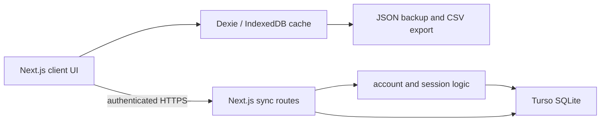

# 02. Technical requirements

[View visual brief](visuals/02-technical-requirements.svg)

## Architecture

Tember retains its existing Next.js App Router architecture. The browser owns immediate reads and writes through Dexie and IndexedDB. It uses same-origin authenticated routes for account and record operations; only those Node.js routes use `@libsql/client` with Turso environment variables.

## Technology decisions

| Area | Decision | Rationale and constraint |
| --- | --- | --- |
| UI | Next.js 15 App Router, React 19, TypeScript strict, Tailwind, shadcn conventions | Existing structure supports accessible reusable UI without a rewrite. |
| Local persistence | Dexie 4 / IndexedDB | Fast offline cache and transactional local changes. Keep it even when sync is configured. |
| Validation | Zod schemas in `lib/validation` | Validate drafts and portable data before persistence. |
| Server sync | Node.js route handlers with `@libsql/client` | Keeps Turso URL and token server-only. |
| Remote merge | UUID records, `updatedAt`, tombstones | Newer edit wins; deletion tombstones prevent an old copy from returning. |
| Quality | ESLint, TypeScript, Vitest, Testing Library, Playwright | Existing commands provide the release gate. |

## Configuration and contracts

`TURSO_DATABASE_URL` and `TURSO_AUTH_TOKEN` are server-only production configuration. With either missing, sync reports not configured and local functionality remains usable. Do not publish either value in client bundles, backups, logs, or error messages.

Routes are: `POST /api/sync/setup`, `POST /api/sync/login`, `POST /api/sync/logout`, `GET /api/sync/status`, and authenticated `GET`/`POST /api/sync/records`. Records use a `SyncSnapshot` of pets, measurements, vaccinations, and tombstones. A POST merges the submitted snapshot and returns the household snapshot. Invalid bodies return 400; unauthenticated requests return 401.

## Security, privacy, and reliability

- Store password hashes with a per-password salt and scrypt. Use HTTP-only, same-site session cookies; set `secure` in production.
- Scope every remote query and merge to the authenticated account ID. Treat account IDs, session IDs, sync snapshots, portrait data, and backups as sensitive.
- Validate request and import data at the trust boundary. Do not trust browser types or a backup’s claimed version alone.
- Preserve the current 90-day session lifetime only if it meets the approved privacy policy; otherwise make it configurable and document the migration.
- **Recommendation:** before a public release, add rate limiting or a suitable abuse control around setup and login, session cleanup/expiry handling, generic authentication failures, and structured server-side error logging that excludes record payloads and credentials.
- **Open question:** recovery/reset authority and remote retention are product-policy decisions, not implementation defaults.

## Quality attributes

| Attribute | Requirement |
| --- | --- |
| Performance | Open cached records without waiting for the network. Batch remote writes. Keep chart and history usable for dense journals. |
| Accessibility | Semantic HTML, labelled controls, 44px touch targets, keyboard chart exploration, visible focus, reduced motion, and no colour-only meaning. |
| Responsive behaviour | Mobile-first at 320–768px; deliberate contained scrollers for genuinely wide content; browser zoom remains enabled. |
| Observability | Record safe operational events such as sync request result and latency, never credentials or full pet content. Define alert ownership before launch. |
| Compatibility | Maintain migration paths for IndexedDB schema versions and JSON backup versions. Preserve v1 backup import by transforming it to the current model. |

## Test and deployment gates

Run `pnpm lint`, `pnpm typecheck`, and `pnpm test` on every release candidate. When a development server is expressly available, run the affected Playwright viewport and local-first/sync scenarios. Production deployment requires environment-variable presence, HTTPS, a verified cookie configuration, a restore test from JSON, and a tested Turso connection. Roll back the server deployment if authentication or record retrieval fails; the local device cache remains available, and users can export a backup before remediation.
