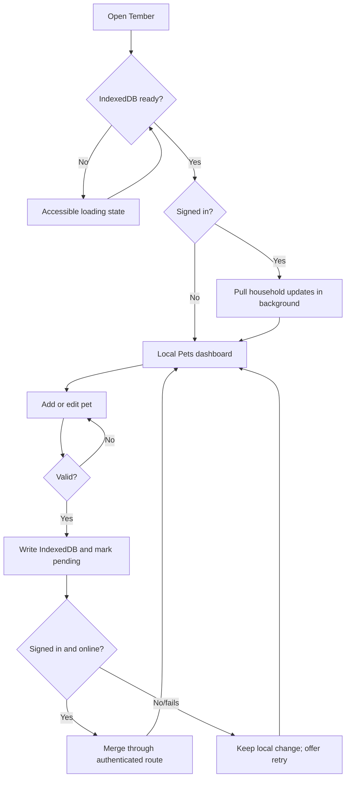

# 03. App flow

[View visual brief](visuals/03-app-flow.svg)

## Route and screen inventory

| Entry or view | Purpose | Important states |
| --- | --- | --- |
| `/` Pets dashboard | List pet journals and begin profile or measurement entry | Storage loading, true empty, local records, sync checking, sync attention |
| Pet journal | Review one pet’s growth and care log | No measurements, dense history, chart selection, form and confirmation dialogs |
| Add/edit pet dialog | Capture profile, optional portrait, and notes | Client file error, validation error, saving, saved |
| Add/edit measurement dialog | Capture required date and weight plus optional dimensions | Field error, saving, saved |
| Add/edit vaccination dialog | Capture vaccine log entry | Field error, saving, saved |
| Data view | Sync, JSON/CSV export, JSON import, local deletion | Not configured, signed out, syncing, pending, success, error, confirmation |
| Account dialog | Create the household account or sign in | Setup available, existing account, invalid credentials, connecting |

## Primary journeys

### Record a measurement

From a pet journal, the caregiver opens **Add measurement**, enters a valid date and positive weight, and may leave any dimension blank. Client validation blocks invalid input. A successful save updates the journal immediately, queues sync, and attempts a background upload when authenticated. A failure after the local save does not dismiss the record or imply it was lost.

### Share a household

From Data, a first caregiver creates the one shared account or another caregiver signs in with the existing account. Account input rejects invalid names and short passwords. After authentication, the device performs the appropriate merge/pull and returns to local records with sync status. A 401 returns the person to the account action. A network failure preserves the device cache and gives a retry path.

### Import, export, and deletion

Export creates either a complete versioned JSON backup or CSV measurement rows. Import reads and validates the entire JSON file before the user confirms replacement. A parse or relationship error leaves all current data untouched. Delete-all and per-record deletion require clear, specific confirmations; local removals create tombstones when sync is enabled so older remote copies do not reappear.

## State rules

| Condition | Required response |
| --- | --- |
| IndexedDB is not ready | Show an accessible loading state, not a false empty dashboard. |
| No local pets | Show the genuine first-pet empty state. |
| Sync not configured | Keep local features available and omit any implication that data is remotely protected. |
| Sync unavailable or upload fails | Preserve local changes, retain pending state, state that the records are safe on this device, offer Sync now. |
| Remote conflict | Apply latest `updatedAt`; tombstone wins when its deletion time is newer than the record update. |
| Unsupported image | Reject it before persistence, explain accepted types and size. |
| Narrow screen | Keep the document within viewport; use a contained table scroller or an expanded-row mobile history. |
