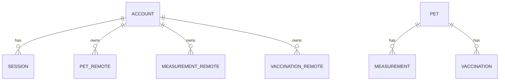

# 05. Backend and data schema

[View visual brief](visuals/05-backend-and-data-schema.svg)

## Ownership and storage model

The browser’s IndexedDB database is the immediate device cache and the only required storage for a local-only person. A signed-in household additionally has one remote account in Turso. Every remote record belongs to that account, while all records retain locally generated UUIDs so devices can merge safely.



## Local entities

| Entity | Fields and validation | Lifecycle |
| --- | --- | --- |
| Pet | UUID `id`; `name` 1–80 chars; enumerated `species`; `sex`; optional ISO `birthDate`, non-negative `estimatedAgeYears`, photo data URL, notes; ISO audit times | Create, edit, delete. Deletion cascades locally to linked measurements and vaccinations. |
| Measurement | UUID; `petId`; valid `measuredAt` `YYYY-MM-DD`; required finite positive `weightGram`; optional finite positive `shellLengthMm`, `shellWidthMm`, `shellHeightMm`; optional notes and audit times | Create, edit, delete. A missing optional dimension is absent, never zero. |
| Vaccination | UUID; `petId`; valid ISO calendar date; name 1–160 chars; optional notes and audit times | Create, edit, delete. It is a factual log, not treatment guidance. |
| Tombstone | `entityId`, entity type, ISO `deletedAt` | Created for synced deletion and kept to prevent stale resurrection. |
| App state | key/value flags such as pending sync | Device-only operational state, not portable pet data. |

Dates selected by people use the exact calendar string `YYYY-MM-DD`; `createdAt`, `updatedAt`, and deletion timestamps are ISO date-time strings. JSON backups are currently version 2 and import version 1 by adding an empty vaccination array.

## Remote schema and permission matrix

Turso stores `accounts`, `sessions`, and one table each for pet, measurement, and vaccination payloads. Remote record tables include a record UUID primary key, `account_id`, serialized payload, `updated_at`, and optional `deleted_at`; lookup indexes exist on account IDs. Server routes create the schema as needed.

| Role | Local records | Remote records | Account administration |
| --- | --- | --- | --- |
| Unsigned-in device user | Read/write current IndexedDB data; import/export/delete | None | Can start setup if no account exists |
| Authenticated household member | Read/write cache and initiate sync | Read/write only their household snapshot | Can sign out this device; no separate admin role |
| Server route | Never renders credentials to browser | Uses account ID from session to scope all reads/writes | Creates/verifies sessions and account |

**Recommendation:** document whether the first account creator has additional recovery authority. Until that decision, no browser flow should imply admin, password recovery, or account deletion capabilities that do not exist.

## Sync, API, and conflict contract

```ts
type SyncSnapshot = {
  pets: Pet[];
  measurements: Measurement[];
  vaccinations: Vaccination[];
  tombstones: Tombstone[];
};
```

Authenticated `POST /api/sync/records` accepts a validated snapshot, merges it into the session’s household, and returns the merged current snapshot. `GET` returns the household snapshot. The browser marks each local mutation pending before upload. A successful POST applies the response then clears the pending flag; an error leaves it pending. Foreground, interval, and explicit synchronization retry safely.

For the same ID, the later `updatedAt` wins. A tombstone whose `deletedAt` is at or after a record’s `updatedAt` wins. A newer record update can clear an older tombstone. This design deliberately prefers deterministic last-write-wins behaviour over manual conflict UI for the one-household scope.

## Privacy, backup, and retention

Portraits may be embedded data URLs and therefore can appear in IndexedDB, a JSON backup, and sync payloads. Exports are user-controlled portable files and must not be uploaded automatically. The app must warn before replacing or deleting local records. Remote account/session and record retention, household deletion, recovery, and support access are unresolved product-policy questions; resolve them before a public launch and align operational deletion with the documented policy.
