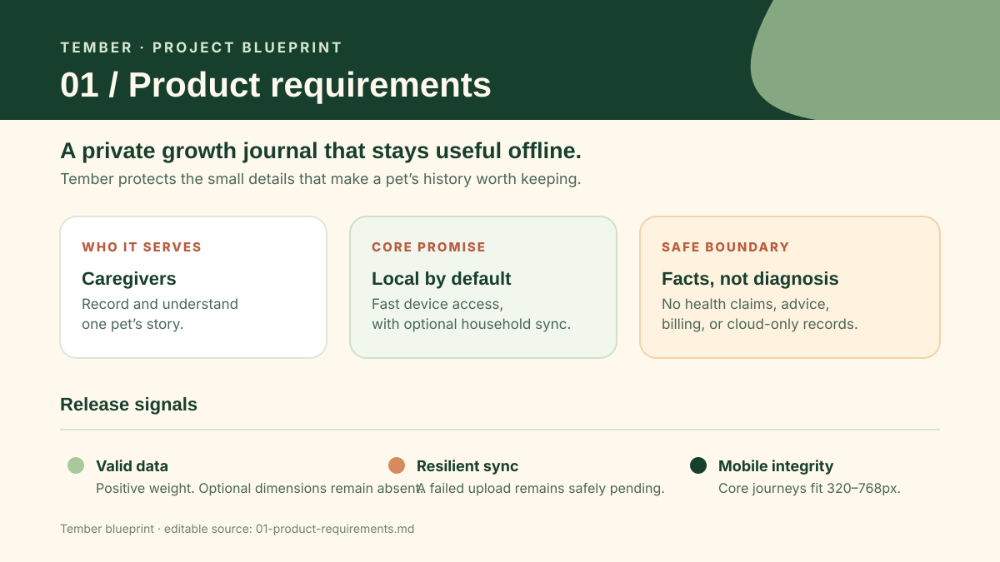
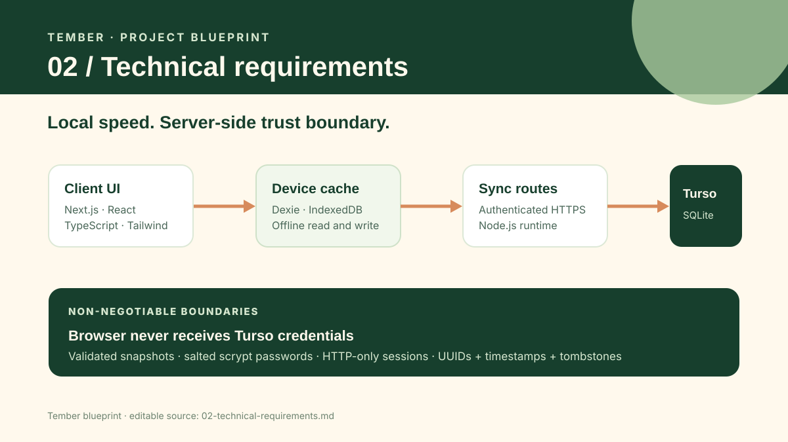
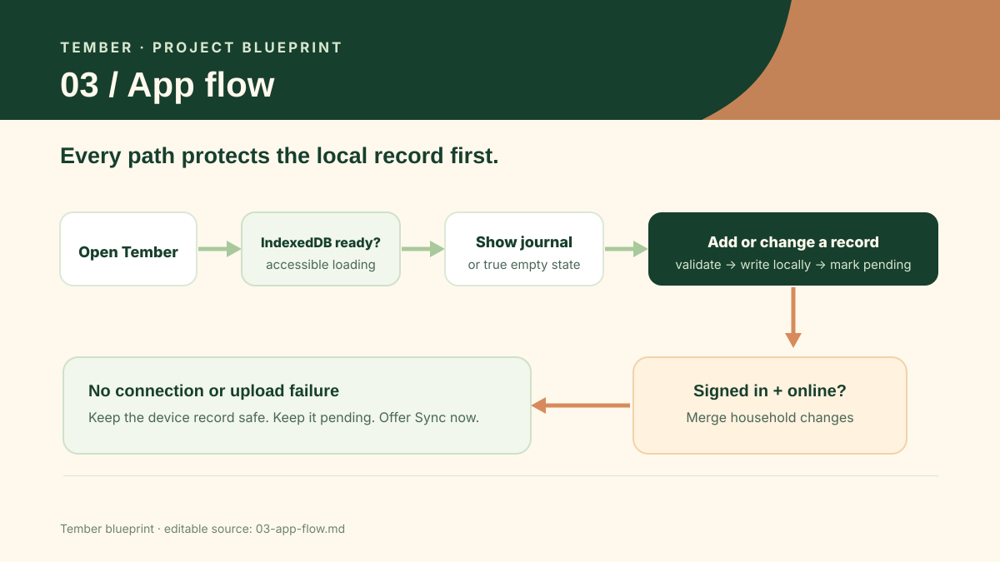
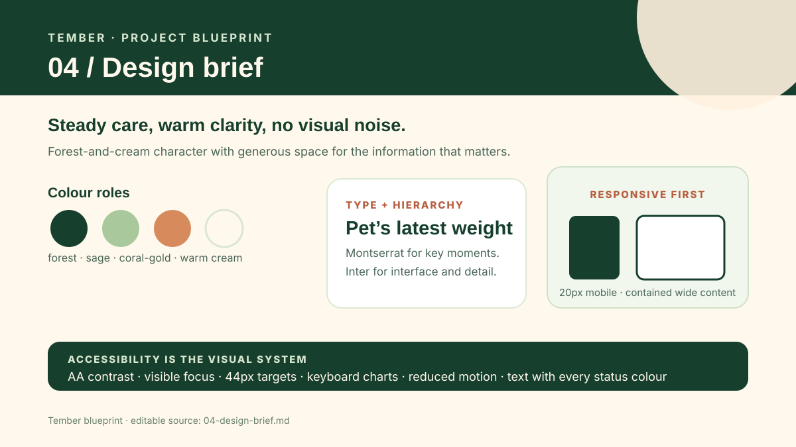
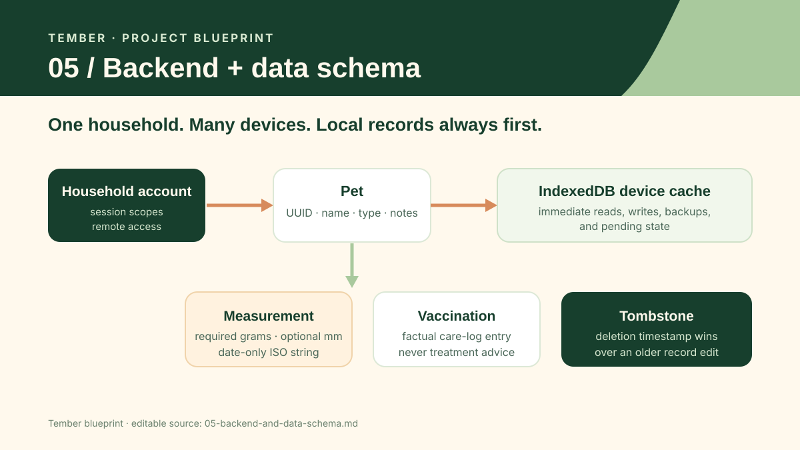
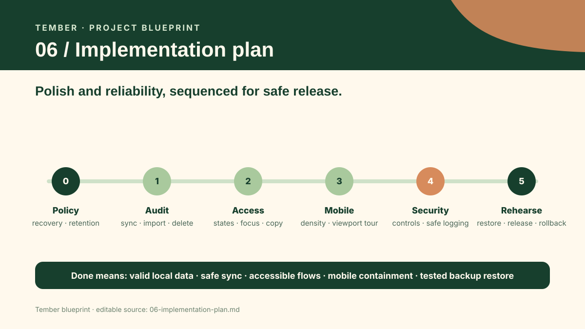

# Tember project blueprint

Last updated: 2026-10-09. Current phase: planning for the approved **Polish and reliability** iteration after the completed local-first and shared-household releases.

Tember is a private pet growth tracker. It keeps a responsive IndexedDB cache on every device, supports portable JSON and CSV exports, and can synchronize one household account through authenticated server routes to Turso.

## Confirmed decisions

- The product works for any pet. Weight is required and stored as grams; length, width, and height are optional and stored as millimetres.
- IndexedDB stays the source of immediate device experience. Shared sync is additive, authenticated, server-mediated, and never exposes Turso credentials to a browser.
- English ships first. All interface text belongs in `lib/i18n/messages/`; display formatting uses shared helpers.
- The visual baseline is the supplied Stitch direction: forest, cream, sage, and restrained coral-gold with Montserrat and Inter.

## Assumptions

- This blueprint frames the next authorised scope as reliability, accessibility, data safety, and release readiness. It does not add health interpretation, social features, a multi-household service, billing, or cloud-only storage.
- Production remains a Next.js deployment with server environment variables for Turso. A chosen host and incident process remain to be confirmed before launch.

## Open questions

1. Who can reset or recover a shared account if its password is lost? No recovery flow exists today.
2. What are the retention and deletion expectations for the remote household data after a household stops using sync?
3. Which production host, error monitoring service, and supported browser versions are approved for release?

## Documents

1. [Product requirements](01-product-requirements.md) · [visual brief](visuals/01-product-requirements.svg)

   

2. [Technical requirements](02-technical-requirements.md) · [visual brief](visuals/02-technical-requirements.svg)

   

3. [App flow](03-app-flow.md) · [visual brief](visuals/03-app-flow.svg)

   

4. [Design brief](04-design-brief.md) · [visual brief](visuals/04-design-brief.svg)

   

5. [Backend and data schema](05-backend-and-data-schema.md) · [visual brief](visuals/05-backend-and-data-schema.svg)

   

6. [Implementation plan](06-implementation-plan.md) · [visual brief](visuals/06-implementation-plan.svg)

   
